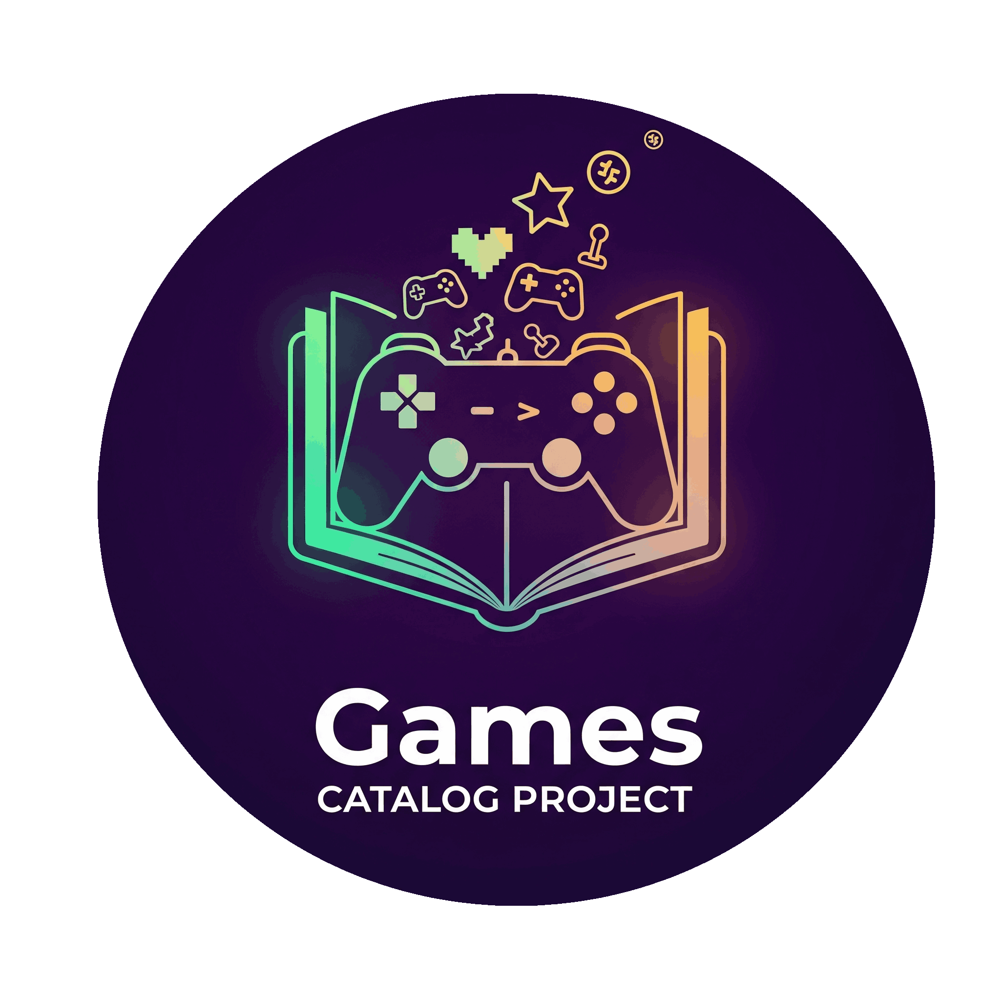
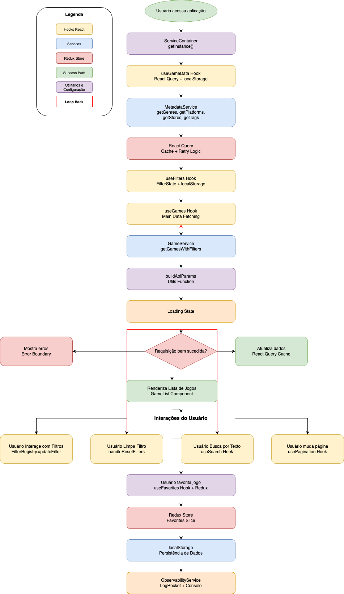
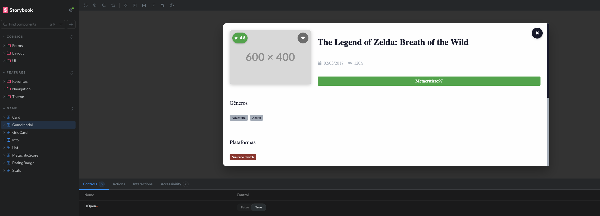
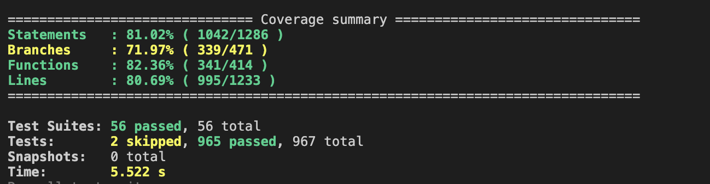
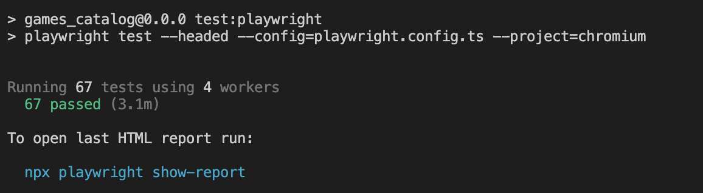
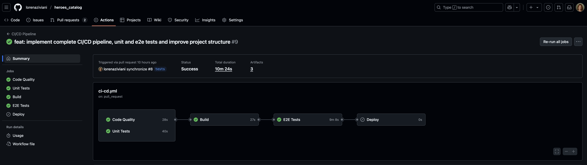
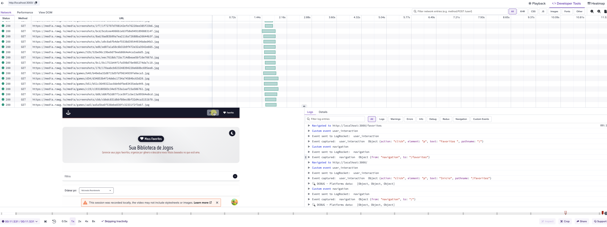

# Games Catalog - Sistema de Catálogo de Jogos

<div align="center">


<div data-badges>
  
  
  
</div>

<div data-badges>
  
  
  
  
  
  
  
  
</div>
</div> </br>

O **Games Catalog** é uma aplicação React TypeScript de nível empresarial que demonstra arquitetura limpa, performance otimizada, testes abrangentes e ferramentas profissionais para criar uma experiência de usuário excepcional:

✔ **Clean Architecture** com separação clara de responsabilidades e inversão de dependência

✔ **Domain-Driven Design** implementando entidades, repositórios e serviços de domínio

✔ **Sistema de Filtros Modular** com padrões Registry e Adapter para máxima reutilização

✔ **Gerenciamento de Estado Avançado** combinando Redux Toolkit e React Query

✔ **Testes Abrangentes** com Jest, React Testing Library, Playwright e Storybook

✔ **Observabilidade Completa** com LogRocket para tracking de erros e performance

✔ **Sistema de Design Responsivo** com tokens centralizados e tema dinâmico

✔ **Acessibilidade WCAG 2.1** com modos de cor, tamanhos de fonte e redução de movimento

Desenvolvido com React 19, TypeScript 5.8 e Vite 7.0, o sistema garante alta performance, manutenibilidade e experiência de usuário excepcional para ambientes de produção.

## Índice

- [Visão Geral](#visão-geral)
- [Arquitetura do Sistema](#arquitetura-do-sistema)
- [Stack Tecnológica](#stack-tecnológica)
- [Princípios e Decisões Arquiteturais](#princípios-e-decisões-arquiteturais)
- [Funcionalidades Implementadas](#funcionalidades-implementadas)
- [Sistema de Design](#sistema-de-design)
- [Qualidade e Testes](#qualidade-e-testes)
- [CI/CD Pipeline](#cicd-pipeline)
- [Observabilidade](#observabilidade)
- [Performance e Otimização](#performance-e-otimização)
- [Acessibilidade](#acessibilidade)
- [Como Executar](#como-executar)
- [Contribuição](#contribuição)

## Visão Geral

O **Games Catalog** é uma aplicação React TypeScript que demonstra as melhores práticas de desenvolvimento frontend em nível senior. O projeto implementa uma arquitetura limpa, gerenciamento de estado avançado, testes abrangentes e ferramentas profissionais para criar uma experiência de usuário excepcional.

### Objetivos do Projeto

- **Escalabilidade**: Arquitetura escalável e manutenível
- **Qualidade de Código**: Padrões rigorosos e documentação completa
- **Performance**: Otimizações avançadas e métricas de Core Web Vitals
- **Testes Abrangentes**: Cobertura completa com diferentes tipos de teste
- **DevOps**: Pipeline de CI/CD robusto e automatizado
- **Acessibilidade**: Experiência inclusiva para todos os usuários

## 🏗️ Arquitetura do Sistema

### **Diagrama da Arquitetura**


### **Princípios Arquiteturais**

#### **1. Clean Architecture**

- **Separação de Responsabilidades**: Domínio, aplicação, infraestrutura e interface
- **Inversão de Dependência**: Dependências apontam para abstrações
- **Independência de Frameworks**: Lógica de negócio isolada
- **Testabilidade**: Componentes facilmente testáveis

#### **2. Domain-Driven Design (DDD)**

- **Entidades**: `Game`, `GameCollection`
- **Repositórios**: `IGameRepository`, `IFavoritesRepository`
- **Serviços de Domínio**: `GameDomainService`
- **Agregados**: `GameCollection`

#### **3. Component-Based Architecture**

- **Componentes Atômicos**: UI components reutilizáveis
- **Composição**: Componentes complexos construídos a partir de componentes simples
- **Props Interface**: Contratos bem definidos entre componentes
- **Custom Hooks**: Lógica de negócio reutilizável

## Stack Tecnológica

### **Core Framework**

- **React 19** - Framework de UI moderno com hooks avançados
- **TypeScript 5.8** - Segurança de tipos rigorosa e IntelliSense
- **Vite 7.0** - Build tool otimizado e dev server rápido

### **Gerenciamento de Estado**

- **Redux Toolkit 2.8** - Gerenciamento de estado global com DevTools
- **React Query (TanStack Query) 5.83** - Gerenciamento de estado do servidor
- **React Router DOM 7.7** - Roteamento declarativo

### **Styling e Design**

- **Styled Components 6.1** - CSS-in-JS com tema dinâmico
- **React Icons 5.5** - Biblioteca de ícones consistente
- **Design System** - Tokens centralizados e componentes reutilizáveis

### **Qualidade de Código**

- **ESLint 9.32** - Análise estática com regras rigorosas
- **Prettier 3.6** - Formatação automática consistente
- **Husky 9.1** - Git hooks para qualidade
- **Lint-Staged 16.1** - Validação pré-commit

### **Testes**

- **Jest 30.0** - Framework de testes unitários
- **React Testing Library 16.3** - Testes de componentes
- **Playwright 1.54** - Testes end-to-end
- **Storybook 9.0** - Documentação e teste de componentes

### **Observabilidade**

- **LogRocket 10.1** - Captura de erros, performance e analytics
- **Error Tracking** - Stack traces detalhados
- **Performance Monitoring** - Métricas de Core Web Vitals

## Princípios e Decisões Arquiteturais

### **1. Por que React 19 + TypeScript?**

**Decisão**: Utilizar React 19 com TypeScript para utilizar o que há de mais moderno e a segurança de tipagem que o Typescript fornece.

**Benefícios**:

- **Type Safety**: Eliminação de erros em tempo de compilação
- **Developer Experience**: IntelliSense avançado e refactoring seguro
- **Performance**: React 19 com otimizações automáticas
- **Maintainability**: Código auto-documentado e fácil de manter

### **2. Por que Vite como Build Tool?**

**Decisão**: Vite oferece desenvolvimento mais rápido e build otimizado.

**Benefícios**:

- **Hot Module Replacement**: Recarregamento instantâneo
- **ES Modules**: Carregamento nativo mais rápido
- **Plugin System**: Extensibilidade para diferentes formatos
- **Build Optimization**: Bundle splitting e tree shaking automático

### **3. Por que Redux Toolkit + React Query?**

**Decisão**: Combinação de ferramentas para diferentes tipos de estado.

**Benefícios**:

- **Redux Toolkit**: Estado global complexo (favoritos, filtros)
- **React Query**: Estado do servidor com cache inteligente
- **Separation of Concerns**: Estado local vs global vs servidor
- **Developer Tools**: Debugging avançado para ambos

### **4. Por que Styled Components?**

**Decisão**: CSS-in-JS para tema dinâmico e componentes isolados.

**Benefícios**:

- **Theme Integration**: Tema claro/escuro dinâmico
- **Component Scoping**: Estilos isolados por componente
- **Dynamic Styling**: Props para variações de estilo
- **TypeScript Support**: Tipagem de props de estilo

### **5. Por que Testes Abrangentes?**

**Decisão**: Cobertura completa para garantir qualidade e manutenibilidade.

**Estratégia**:

- **Unit Tests**: Lógica de negócio e utilitários
- **Component Tests**: Comportamento de componentes
- **Integration Tests**: Interação entre componentes
- **E2E Tests**: Fluxos completos do usuário
- **Storybook**: Documentação e teste visual

## Funcionalidades Implementadas

### **1. Sistema de Filtros Avançado**

O sistema de filtros foi desenvolvido com arquitetura modular e reutilizável, demonstrando padrões de design avançados.



#### **Características Técnicas**:

- **Arquitetura Modular**: Filtros independentes e reutilizáveis
- **Registry Pattern**: Sistema de registro dinâmico de filtros
- **Adapter Pattern**: Adaptadores para diferentes tipos de filtro
- **Custom Hooks**: `useFilters`, `useGameData` para lógica reutilizável
- **Persistência Local**: Filtros salvos automaticamente
- **TypeScript Enums**: Tipos centralizados e type-safe

#### **Componentes de Filtro**:

```typescript
// Exemplo de filtro modular
interface FilterAdapter {
  getValue(): FilterValue
  setValue(value: FilterValue): void
  reset(): void
}

// Implementação específica
class DateRangeFilterAdapter implements FilterAdapter {
  // Implementação type-safe
}
```

### **2. Sistema de Favoritos Completo**

Implementação robusta com Redux Toolkit e persistência local, demonstrando gerenciamento de estado complexo.


#### **Características Técnicas**:

- **Redux Toolkit**: `createSlice`, `createAsyncThunk`
- **Persistência Local**: localStorage com serialização
- **Seletores Memoizados**: Performance otimizada
- **Async Actions**: Carregamento assíncrono de favoritos
- **Error Handling**: Tratamento robusto de erros
- **TypeScript**: Tipos rigorosos para state e actions

#### **Arquitetura do Store**:

```typescript
// Slice com async thunks
const favoritesSlice = createSlice({
  name: 'favorites',
  initialState,
  reducers: {
    // Sync actions
  },
  extraReducers: builder => {
    // Async actions
  }
})
```

### **3. Sistema de Acessibilidade Avançado**

Implementação completa de acessibilidade com múltiplas funcionalidades para garantir inclusão.

#### **Funcionalidades**:

- **Modos de Cor**: Normal, Daltonismo, Alto Contraste
- **Tamanhos de Fonte**: Normal, Grande, Extra Grande
- **Redução de Movimento**: Para usuários sensíveis
- **Persistência Local**: Configurações salvas automaticamente
- **Integração com Tema**: Modos de acessibilidade integrados

#### **Arquitetura**:

```typescript
// Hook centralizado
export const useAccessibility = () => {
  const [mode, setMode] = useState<AccessibilityMode>()
  const [fontSize, setFontSize] = useState<FontSize>()
  const [reduceMotion, setReduceMotion] = useState<boolean>()

  // Aplicação automática de classes CSS
  // Persistência no localStorage
  // Integração com sistema de temas
}
```

### **4. Sistema de Design Responsivo**

Design system completo com tokens centralizados e componentes reutilizáveis.

#### **Características**:

- **Design Tokens**: Cores, tipografia, espaçamentos centralizados
- **Breakpoints Responsivos**: Mobile-first approach
- **Componentes Atômicos**: Button, Text, Tag, etc.
- **Tema Dinâmico**: Claro/escuro com transições suaves
- **Acessibilidade**: Contraste adequado e navegação por teclado

## Sistema de Design

### **Design Tokens**

```typescript
// Cores centralizadas
export const colors = {
  primary: '#007AFF',
  secondary: '#5856D6',
  success: '#34C759',
  warning: '#FF9500',
  error: '#FF3B30'
  // ... outras cores
}

// Tipografia
export const typography = {
  h1: { fontSize: '2.5rem', fontWeight: 700 },
  h2: { fontSize: '2rem', fontWeight: 600 },
  body: { fontSize: '1rem', fontWeight: 400 }
  // ... outros estilos
}

// Espaçamentos
export const spacing = {
  xs: '0.25rem',
  sm: '0.5rem',
  md: '1rem',
  lg: '1.5rem',
  xl: '2rem'
  // ... outros espaçamentos
}
```

### **Componentes Reutilizáveis**

- **UI Components**: Button, Text, Tag, Image, LoadingSpinner
- **Layout Components**: Header, Banner, Container
- **Form Components**: Filters, Sort, SearchBar
- **Game Components**: Card, GameModal, Stats

### **Storybook Organization**

Organização profissional do Storybook para documentação e testes visuais:

```
Storybook/
├── Game/           # Componentes específicos de jogos
├── Common/UI/      # Componentes de interface reutilizáveis
├── Common/Layout/  # Componentes de layout
├── Common/Forms/   # Componentes de formulário
└── Features/       # Componentes de funcionalidades
```



## Qualidade e Testes

### **Resultados dos Testes**

#### **Testes Unitários**



#### **Testes End-to-End (Playwright)**



### **Estratégia de Testes**

#### **1. Testes Unitários (Jest + RTL)**

- **Cobertura**: Mínimo 80%
- **Foco**: Lógica de negócio e utilitários
- **Mocks**: APIs e dependências externas
- **Snapshots**: Componentes de UI

#### **2. Testes de Componentes (React Testing Library)**

- **User-Centric**: Testes baseados no comportamento do usuário
- **Accessibility**: Testes de acessibilidade integrados
- **Integration**: Testes de interação entre componentes

#### **3. Testes E2E (Playwright)**

- **Critical Paths**: Fluxos principais do usuário
- **Cross-Browser**: Chrome, Firefox, Safari
- **Performance**: Métricas de performance
- **Visual Regression**: Screenshots automáticos

#### **4. Storybook**

- **Documentation**: Histórias para cada componente
- **Visual Testing**: Testes visuais automatizados
- **Accessibility**: Addon de acessibilidade
- **Themes**: Testes com diferentes temas

### **Configuração de Qualidade**

```json
// ESLint configuração rigorosa
{
  "extends": [
    "@eslint/js",
    "eslint:recommended",
    "plugin:react-hooks/recommended"
  ],
  "rules": {
    "no-unused-vars": "error",
    "no-console": "warn",
    "@typescript-eslint/no-explicit-any": "error"
  }
}
```

## CI/CD Pipeline

### **Pipeline Completo**



#### **Workflows Implementados**:

1. **CI/CD Principal** (`ci-cd.yml`)
   - Code Quality (ESLint, Prettier, TypeScript)
   - Unit Tests (Jest com cobertura)
   - Build (Vite)
   - E2E Tests (Playwright)
   - Deploy (GitHub Pages)

2. **Security & Dependencies** (`security.yml`)
   - Security Audit (npm audit)
   - Dependency Review
   - Weekly automated checks

3. **Performance & Bundle** (`performance.yml`)
   - Bundle Analysis
   - Lighthouse Performance Tests

4. **Playwright Tests** (`playwright.yml`)
   - Dedicated E2E testing

#### **Configuração**:

- **Node.js**: v20
- **Cache**: npm dependencies
- **Artifacts**: 30 dias de retenção
- **Timeout**: 10-60 minutos por job

#### **Deploy Automático**:

- **Trigger**: Push para `main`/`master`
- **Platform**: GitHub Pages
- **Branch**: `gh-pages`
- **Custom Domain**: Configurável via secret `CNAME`

## Observabilidade

### **LogRocket Integration**



#### **Funcionalidades Implementadas**:

- **Error Tracking**: Captura automática de erros
- **Performance Monitoring**: Métricas de Core Web Vitals
- **User Analytics**: Tracking de eventos e comportamento
- **Session Replay**: Reprodução de sessões para debug
- **API Monitoring**: Monitoramento de chamadas de API

#### **Configuração**:

```typescript
// Integração com React Query
const queryClient = new QueryClient({
  defaultOptions: {
    queries: {
      retry: 3,
      staleTime: 5 * 60 * 1000, // 5 minutos
      gcTime: 10 * 60 * 1000 // 10 minutos
    }
  }
})
```

## Performance e Otimização

### **Estratégias Implementadas**

#### **1. React Query Optimization**

- **Cache Inteligente**: Cache de requisições otimizado
- **Background Refetching**: Atualização em background
- **Optimistic Updates**: Atualizações otimistas para melhor UX
- **Retry Logic**: Lógica de retry inteligente
- **Cancelamento de Requisições**: AbortController para requisições

#### **2. Bundle Optimization**

- **Code Splitting**: Lazy loading de componentes
- **Tree Shaking**: Eliminação de código não utilizado
- **Dynamic Imports**: Importação dinâmica de módulos
- **Bundle Analysis**: Análise contínua do bundle

#### **3. Runtime Optimization**

- **React.memo**: Otimização de re-renderização
- **useMemo/useCallback**: Memoização de valores e funções
- **Debounce**: Otimização de busca em tempo real
- **Virtual Scrolling**: Para listas grandes (preparado)

#### **4. Core Web Vitals**

- **Largest Contentful Paint (LCP)**: < 2.5s
- **First Input Delay (FID)**: < 100ms
- **Cumulative Layout Shift (CLS)**: < 0.1

## Acessibilidade

### **Implementação Completa**

#### **1. WCAG 2.1 Compliance**

- **Perceivable**: Contraste adequado, texto alternativo
- **Understandable**: Interface previsível e legível
- **Robust**: Compatível com tecnologias assistivas

#### **2. Funcionalidades Específicas**

- **Modos de Cor**: Adaptação para daltonismo
- **Tamanhos de Fonte**: Escalabilidade de texto
- **Redução de Movimento**: Para usuários sensíveis

## Como Executar

### **Pré-requisitos**

- Node.js 18+
- npm ou yarn

### **Instalação**

```bash
# Clone o repositório
git clone https://github.com/lorenaziviani/games-catalog.git
cd games-catalog

# Instale as dependências
npm install

# Configure as variáveis de ambiente
cp .env.example .env
# Edite o arquivo .env com suas configurações
```

### **Desenvolvimento**

```bash
# Inicie o servidor de desenvolvimento
npm run dev

# Abra http://localhost:5173
```

### **Testes**

```bash
# Testes unitários
npm run test

# Testes com coverage
npm run test:coverage

# Testes e2e
npm run test:e2e

# Storybook
npm run storybook
```

### **Build**

```bash
# Build para produção
npm run build

# Preview da build
npm run preview
```

### **Qualidade de Código**

```bash
# Lint
npm run lint

# Lint com fix
npm run lint:fix

# Type check
npm run type-check
```

## 📁 Estrutura do Projeto

```
games_catalog/
├── src/
│   ├── components/          # Componentes reutilizáveis
│   │   ├── common/         # Componentes comuns
│   │   │   ├── ui/         # UI components
│   │   │   ├── layout/     # Layout components
│   │   │   └── forms/      # Form components
│   │   ├── game/           # Game-specific components
│   │   └── features/       # Feature-specific components
│   ├── hooks/              # Custom hooks
│   ├── pages/              # Páginas da aplicação
│   ├── store/              # Redux store
│   ├── services/           # Serviços e APIs
│   ├── styles/             # Estilos globais e temas
│   ├── types/              # Tipos TypeScript
│   ├── utils/              # Utilitários
│   └── config/             # Configurações
├── docs/                   # Documentação
├── e2e/                    # Testes end-to-end
├── scripts/                # Scripts utilitários
└── public/                 # Arquivos públicos
```

## Contribuição

### **Fluxo de Desenvolvimento**

1. **Fork o projeto**
2. **Crie uma feature branch** (`git checkout -b feature/AmazingFeature`)
3. **Desenvolva seguindo os padrões**:
   - ESLint e Prettier configurados
   - Testes obrigatórios
   - TypeScript strict mode
   - Conventional commits
4. **Commit suas mudanças** (`git commit -m 'feat: add amazing feature'`)
5. **Push para a branch** (`git push origin feature/AmazingFeature`)
6. **Abra um Pull Request**

### **Padrões de Código**

- **Conventional Commits**: Padrão semântico de commits
- **TypeScript Strict**: Configuração rigorosa de tipos
- **ESLint Rules**: Regras automáticas de qualidade
- **Test Coverage**: Mínimo 80% de cobertura
- **Accessibility**: WCAG 2.1 compliance

### **Scripts Disponíveis**

```bash
# Desenvolvimento
npm run dev              # Servidor de desenvolvimento
npm run build            # Build para produção
npm run preview          # Preview da build

# Testes
npm run test             # Testes unitários
npm run test:coverage    # Testes com cobertura
npm run test:e2e         # Testes end-to-end
npm run storybook        # Storybook

# Qualidade
npm run lint             # ESLint
npm run lint:fix         # ESLint com fix
npm run format           # Prettier
npm run type-check       # TypeScript check

# Segurança
npm run security:audit   # Auditoria de segurança
npm run security:outdated # Dependências desatualizadas
```

## 📚 Documentação Adicional

- [Arquitetura do Sistema](./docs/architecture.md)
- [Guia de Componentes](./docs/components.md)
- [Padrões de Código](./docs/coding-standards.md)
- [Guia de Testes](./docs/testing.md)
- [Deploy e CI/CD](./docs/CI-CD.md)
- [Organização do Storybook](./docs/storybook-organization.md)

## 📄 Licença

Este projeto está sob a licença MIT. Veja o arquivo [LICENSE](LICENSE) para mais detalhes.

---

**Desenvolvido com ❤️ para demonstrar expertise em desenvolvimento frontend senior**
