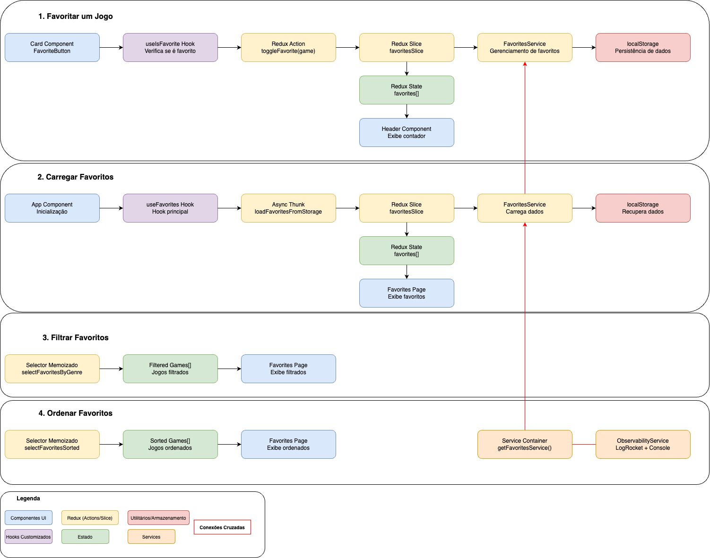

# 🎮 Games Catalog - Sistema de Catálogo de Jogos

## Visão Geral

O **Games Catalog** é uma aplicação React TypeScript de nível empresarial que demonstra as melhores práticas de desenvolvimento frontend, incluindo arquitetura limpa, performance otimizada, testes abrangentes e ferramentas profissionais.

## Arquitetura do Sistema

### **Diagrama da Arquitetura**


### **Stack Tecnológica Principal**

- **React 19** - Framework de UI moderno
- **TypeScript** - Segurança de tipos rigorosa
- **Vite** - Build tool e dev server otimizado
- **Styled Components** - CSS-in-JS com tema dinâmico

### **Gerenciamento de Estado Avançado**

- **React Query (TanStack Query)** - Gerenciamento de estado do servidor
- **Cache Inteligente** - Estratégia de cache otimizada
- **Retry Logic** - Lógica de retry inteligente
- **Optimistic Updates** - Atualizações otimistas para melhor UX
- **Background Refetching** - Atualização em background

### **Qualidade de Código e Padrões**

- **ESLint** - Análise estática de código
- **Prettier** - Formatação automática
- **Husky** - Git hooks para qualidade
- **Lint-Staged** - Validação pré-commit
- **TypeScript Strict Mode** - Configuração rigorosa de tipos

### **Testes Abrangentes**

- **Storybook** - Documentação e teste de componentes
- **Jest** - Framework de testes unitários
- **React Testing Library** - Testes de componentes
- **Playwright** - Testes end-to-end
- **Cobertura de Testes** - Relatórios de cobertura

### **Otimização de Performance**

- **Cache Inteligente** - Cache de requisições otimizado
- **Debounce de Busca** - Otimização de busca em tempo real
- **Pré-busca de Dados** - Carregamento antecipado
- **Cancelamento de Requisições** - AbortController para requisições
- **React.memo** - Otimização de re-renderização

### **Segurança e Ambiente**

- **Variáveis de Ambiente** - Configuração segura
- **Validação de Entrada** - Sanitização de dados
- **Configuração CORS** - Cross-origin resource sharing
- **Gerenciamento Seguro de API Key** - Chaves protegidas
- **HTTPS Enforcement** - Forçar conexões seguras

### **Arquitetura Limpa**

- **Clean Code Principles** - Código limpo e legível
- **SOLID Principles** - Princípios de design orientado a objetos
- **Separação de Responsabilidades** - Organização modular
- **Type Safety** - Enums e interfaces tipadas
- **Custom Hooks Pattern** - Reutilização de lógica

### **Estratégia Avançada de API**

- **React Query Senior Level** - Configuração avançada
- **Error Handling** - Tratamento robusto de erros
- **URL Construction** - Construção inteligente de URLs
- **Custom Headers** - Headers personalizados
- **Timeout Handling** - Tratamento de timeouts

### **Sistema de Design**

- **Tema Claro/Escuro** - Sistema de tema dinâmico
- **Design Tokens** - Tokens de design centralizados
- **Design Responsivo** - Adaptação a diferentes telas
- **Acessibilidade** - Recursos de acessibilidade
- **Componentes Reutilizáveis** - Biblioteca de componentes

### **Workflow de Desenvolvimento**

- **Git Version Control** - Controle de versão
- **Feature Branches** - Estratégia de branches
- **CI/CD Pipeline** - Integração e deploy contínuos
- **Deploy Automatizado** - Deploy automático
- **Performance Monitoring** - Monitoramento de performance

## Husky - Git Hooks

### **O que é o Husky?**

O **Husky** é uma ferramenta que permite executar scripts Git hooks de forma fácil e confiável. Ele garante que certas ações sejam executadas automaticamente antes de commits, pushes e outros eventos Git.

### **Configuração no Projeto**

```json
{
  "husky": {
    "hooks": {
      "pre-commit": "lint-staged",
      "commit-msg": "commitlint -E HUSKY_GIT_PARAMS",
      "pre-push": "npm run test"
    }
  }
}
```

### **Hooks Implementados**

#### **Pre-commit Hook**

- **Função**: Executa antes de cada commit
- **Ações**:
  - **Lint-staged**: Executa ESLint e Prettier apenas nos arquivos modificados
  - **TypeScript Check**: Verifica tipos TypeScript
  - **Testes Unitários**: Executa testes básicos
  - **Build Check**: Verifica se o projeto compila

#### **Commit-msg Hook**

- **Função**: Valida a mensagem do commit
- **Ações**:
  - **Commitlint**: Verifica formato da mensagem
  - **Conventional Commits**: Padrão de commits semânticos
  - **Tamanho da Mensagem**: Limita tamanho da mensagem

#### **Pre-push Hook**

- **Função**: Executa antes de cada push
- **Ações**:
  - **Testes Completos**: Executa toda a suíte de testes
  - **Build de Produção**: Verifica build para produção
  - **Cobertura de Testes**: Verifica cobertura mínima

## Estrutura do Projeto

```
heroes_catalog/
├── src/
│   ├── components/          # Componentes reutilizáveis
│   │   ├── Banner/         # Componente de banner com badge
│   │   ├── Card/           # Card de jogo
│   │   ├── FavoriteButton/ # Botão de favoritar
│   │   ├── GameGrid/       # Grid de jogos
│   │   ├── GamesList/      # Lista de jogos
│   │   ├── Header/         # Cabeçalho
│   │   ├── Image/          # Componente de imagem
│   │   ├── Info/           # Informações
│   │   ├── List/           # Lista reutilizável (home/favoritos)
│   │   ├── LoadingSpinner/ # Spinner de carregamento
│   │   ├── MetacriticScore/ # Score do Metacritic
│   │   ├── Pagination/     # Paginação
│   │   ├── RatingBadge/    # Badge de rating
│   │   ├── SearchBar/      # Barra de busca
│   │   ├── Sort/           # Componente de ordenação
│   │   ├── Stats/          # Componente de estatísticas
│   │   ├── Tag/            # Tag
│   │   ├── TagsContainer/  # Container de tags
│   │   ├── Text/           # Componente de texto
│   │   ├── ThemeButton/    # Botão de tema
│   │   └── index.ts        # Exportações
│   ├── config/             # Configurações
│   │   ├── api.ts          # Configuração de API
│   │   └── env.ts          # Variáveis de ambiente
│   ├── hooks/              # Custom hooks
│   │   ├── useFavorites.ts # Hook para favoritos
│   │   ├── useGames.ts     # Hook para jogos
│   │   └── useSort.ts      # Hook para ordenação
│   ├── pages/              # Páginas
│   │   ├── Favorites/      # Página de favoritos
│   │   └── Home/           # Página inicial
│   ├── routes/             # Rotas
│   │   └── index.tsx       # Configuração de rotas
│   ├── services/           # Serviços
│   │   └── gamesApi.ts     # API de jogos
│   ├── store/              # Redux Store
│   │   ├── favorites/      # Slice de favoritos
│   │   │   ├── actions.ts  # Actions assíncronas
│   │   │   ├── index.ts    # Exportações
│   │   │   ├── reducer.ts  # Reducer síncrono
│   │   │   ├── selectors.ts # Seletores memoizados
│   │   │   ├── types.ts    # Tipos do slice
│   │   │   └── utils.ts    # Utilitários do localStorage
│   │   └── index.ts        # Configuração do store
│   ├── styles/             # Estilos
│   │   ├── breakpoint.ts   # Breakpoints responsivos
│   │   ├── fontSize.ts     # Tamanhos de fonte
│   │   ├── global.ts       # Estilos globais
│   │   ├── size.ts         # Sistema de tamanhos
│   │   └── theme.ts        # Temas
│   ├── types/              # Tipos TypeScript
│   │   ├── common.ts       # Tipos comuns (enums, constantes)
│   │   ├── game.ts         # Tipos de jogo
│   │   └── theme.d.ts      # Tipos de tema
│   ├── utils/              # Utilitários
│   │   ├── api.ts          # Utilitários de API
│   │   ├── scrollUtils.ts  # Utilitários de scroll
│   │   ├── test-utils.tsx  # Utilitários de teste
│   │   └── themeUtils.ts   # Utilitários de tema
│   ├── App.tsx             # Componente principal
│   └── main.tsx            # Entry point
├── docs/                   # Documentação
│   └── favorite-flow.drawio.png # Diagrama do fluxo de favoritos
│   └── architecture.drawio.png # Diagrama de arquitetura
├── e2e/                    # Testes end-to-end
├── public/                 # Arquivos públicos
└── tests-examples/         # Exemplos de testes
```

## Funcionalidades Implementadas

### **Funcionalidades Atuais**

#### **Catálogo de Jogos**

- **Listagem de Jogos**: Exibição de jogos populares da API RAWG
- **Busca em Tempo Real**: Busca otimizada com debounce
- **Paginação**: Navegação entre páginas com scroll automático
- **Filtros Avançados**: Filtros por gênero, plataforma, rating
- **Ordenação**: Ordenação por nome, rating, data de lançamento
- **Detalhes do Jogo**: Informações completas de cada jogo
- **Responsividade**: Design adaptativo para diferentes telas

#### **Sistema de Favoritos Completo**

O sistema de favoritos foi implementado com Redux Toolkit e localStorage para persistência de dados, oferecendo uma experiência completa de gerenciamento de jogos favoritos.

##### **Funcionalidades Principais:**

- **Página de Favoritos Dedicada**: Interface completa para gerenciar favoritos
- **Redux State Management**: Gerenciamento de estado centralizado com Redux Toolkit
- **Persistência Local**: Dados salvos automaticamente no localStorage
- **Paginação Inteligente**: Paginação local com scroll automático ao topo
- **Sistema de Ordenação**: Ordenação por nome, avaliação, data de lançamento, data de adição
- **Estatísticas em Tempo Real**: Contadores de total de jogos, avaliação média, gêneros únicos, plataformas únicas
- **Funcionalidade "Limpar Todos"**: Botão para limpar todos os favoritos com confirmação
- **Componentes Reutilizáveis**: Banner, Sort, Stats, List adaptados para favoritos

##### **Componentes Específicos:**

- **Banner Component**: Componente reutilizável com badge personalizável e conteúdo flexível
- **Sort Component**: Sistema de ordenação com enum centralizado em `common.ts`
- **Stats Component**: Exibição de estatísticas dos favoritos (total, média, gêneros, plataformas)
- **List Component**: Lista reutilizável para home e favoritos com configurações específicas

##### **Arquitetura do Sistema de Favoritos:**



O diagrama ilustra o fluxo completo do sistema de favoritos, incluindo:

1. **Favoritar um Jogo**: Interação do usuário → Hook → Redux Action → Reducer → localStorage
2. **Carregar Favoritos**: App → Hook → Async Thunk → Reducer → localStorage → State
3. **Filtrar Favoritos**: Selector Memoizado → Filtros específicos → Componente
4. **Ordenar Favoritos**: Selector Memoizado → Ordenação → Componente

##### **Tecnologias Utilizadas:**

- **Redux Toolkit**: Gerenciamento de estado com createSlice, createAsyncThunk
- **localStorage**: Persistência de dados no navegador
- **TypeScript Enums**: Tipos centralizados em `common.ts` (SortOption, SORT_OPTIONS, DEFAULT_SORT)
- **Custom Hooks**: useFavorites, useIsFavorite, useFavoritesStats, useSort
- **Styled Components**: Design responsivo e tema dinâmico
- **React Query**: Integração com cache para otimização

##### **Configuração de Ambiente:**

O sistema utiliza variáveis de ambiente para configuração flexível:

```typescript
// src/config/env.ts
DEFAULT_PAGE_SIZE: getEnvVar('VITE_DEFAULT_PAGE_SIZE', 20, toNumber)
```

##### **Estrutura de Dados:**

```typescript
// src/store/favorites/types.ts
interface FavoritesState {
  favorites: Game[]
  isLoading: boolean
  error: string | null
}
```

##### **Hooks Personalizados:**

- **useFavorites**: Hook principal para gerenciar favoritos
- **useIsFavorite**: Hook para verificar se um jogo é favorito
- **useFavoritesStats**: Hook para calcular estatísticas
- **useSort**: Hook para ordenação de jogos

##### **Utilitários:**

- **scrollToTop**: Utilitário para scroll automático ao topo
- **favoritesStorage**: Utilitários para localStorage
- **selectors**: Seletores memoizados para performance

#### **Sistema de Design**

- **Tema Claro/Escuro** - Sistema de tema dinâmico
- **Design Tokens** - Tokens de design centralizados
- **Design Responsivo** - Adaptação a diferentes telas
- **Acessibilidade** - Recursos de acessibilidade
- **Componentes Reutilizáveis** - Biblioteca de componentes

## 📋 TODO List - Funcionalidades Pendentes

### **Filtros Avançados**

- [ ] **Filtro por Plataforma**
  - [ ] PlayStation, Xbox, Nintendo, PC
  - [ ] Múltipla seleção
  - [ ] Interface de filtro intuitiva
- [ ] **Filtro por Gênero**
  - [ ] Ação, Aventura, RPG, Estratégia, etc.
  - [ ] Seleção múltipla
  - [ ] Contador de jogos por gênero
- [ ] **Filtro por Rating**
  - [ ] Faixa de rating (1-5)
  - [ ] Slider interativo
  - [ ] Filtro por Metacritic Score
- [ ] **Filtro por Data**
  - [ ] Ano de lançamento
  - [ ] Período personalizado
  - [ ] Jogos recentes vs clássicos
- [ ] **Filtros Combinados**
  - [ ] Múltiplos filtros simultâneos
  - [ ] Salvar filtros favoritos
  - [ ] Reset de filtros

### **Sistema de Favoritos**

- [ ] **Página de Favoritos**
  - [ ] Busca nos favoritos
- [ ] **Persistência de Dados**
  - [ ] Backup de favoritos
- [ ] **Funcionalidades Avançadas**
  - [ ] Categorização de favoritos
  - [ ] Tags personalizadas
  - [ ] Compartilhamento de favoritos

### **Visualização de Jogo**

- [ ] **Página de Detalhes**
  - [ ] Informações completas do jogo
- [ ] **Galeria de Mídia**
  - [ ] Carrossel de screenshots
  - [ ] Vídeos de gameplay
  - [ ] Zoom em imagens
  - [ ] Lightbox para visualização

### **Observabilidade**

- [ ] **Logging e Monitoramento**
  - [ ] Logs de performance
  - [ ] Logs de erros
  - [ ] Métricas de uso
  - [ ] Analytics de usuário
- [ ] **Performance Monitoring**
  - [ ] Tempo de carregamento
  - [ ] Métricas de Core Web Vitals
  - [ ] Monitoramento de API calls
  - [ ] Alertas de performance
- [ ] **Error Tracking**
  - [ ] Captura de erros JavaScript
  - [ ] Stack traces detalhados
  - [ ] Relatórios de erro
  - [ ] Integração com Sentry
- [ ] **User Analytics**
  - [ ] Tracking de eventos
  - [ ] Heatmaps de uso
  - [ ] Funnels de conversão
  - [ ] Relatórios de comportamento

### **Acessibilidade**

- [ ] **Navegação por Teclado**
  - [ ] Tab navigation completa
  - [ ] Atalhos de teclado
  - [ ] Skip links
  - [ ] Focus management
- [ ] **Screen Readers**
  - [ ] ARIA labels apropriados
  - [ ] Alt text para imagens
  - [ ] Landmark roles
  - [ ] Live regions
- [ ] **Contraste e Cores**
  - [ ] Alto contraste
  - [ ] Modo daltonismo
  - [ ] Indicadores visuais
  - [ ] Cores acessíveis
- [ ] **Responsividade**
  - [ ] Zoom até 200%
  - [ ] Texto redimensionável
  - [ ] Layout flexível
  - [ ] Touch targets adequados

### **Testes Unitários**

- [ ] **Componentes**
  - [ ] Testes de renderização
  - [ ] Testes de props
  - [ ] Testes de eventos
  - [ ] Testes de estado
- [ ] **Hooks**
  - [ ] Testes de useGames
  - [ ] Testes de custom hooks
  - [ ] Testes de side effects
  - [ ] Testes de async logic
- [ ] **Utilitários**
  - [ ] Testes de funções puras
  - [ ] Testes de formatação
  - [ ] Testes de validação
  - [ ] Testes de helpers
- [ ] **Cobertura**
  - [ ] Meta de 80% de cobertura
  - [ ] Relatórios de cobertura
  - [ ] Badges de status
  - [ ] CI/CD integration

### **Testes de Integração**

- [ ] **API Integration**
  - [ ] Testes de chamadas de API
  - [ ] Testes de cache
  - [ ] Testes de error handling
  - [ ] Testes de loading states
- [ ] **User Flows**
  - [ ] Fluxo de busca
  - [ ] Fluxo de favoritar
  - [ ] Fluxo de paginação
  - [ ] Fluxo de filtros
- [ ] **State Management**
  - [ ] Testes de React Query
  - [ ] Testes de cache invalidation
  - [ ] Testes de optimistic updates
  - [ ] Testes de background refetch
- [ ] **Cross-Component**
  - [ ] Testes de comunicação entre componentes
  - [ ] Testes de prop drilling
  - [ ] Testes de context providers
  - [ ] Testes de event bubbling

## Como Executar

### **Pré-requisitos**

- Node.js 18+
- npm ou yarn

### **Instalação**

```bash
# Clone o repositório
git clone https://github.com/seu-usuario/heroes-catalog.git
cd heroes-catalog

# Instale as dependências
npm install

# Configure as variáveis de ambiente
cp .env.example .env
# Edite o arquivo .env com suas configurações
```

### **Desenvolvimento**

```bash
# Inicie o servidor de desenvolvimento
npm run dev

# Abra http://localhost:5173
```

### **Build**

```bash
# Build para produção
npm run build

# Preview da build
npm run preview
```

### **Testes**

```bash
# Testes unitários
npm run test

# Testes com coverage
npm run test:coverage

# Testes e2e
npm run test:e2e

# Storybook
npm run storybook
```

### **Qualidade de Código**

```bash
# Lint
npm run lint

# Lint com fix
npm run lint:fix

# Type check
npm run type-check
```

## Documentação

- [Arquitetura do Sistema](./docs/architecture.md)
- [Guia de Componentes](./docs/components.md)
- [Padrões de Código](./docs/coding-standards.md)
- [Guia de Testes](./docs/testing.md)
- [Deploy e CI/CD](./docs/deployment.md)

## Contribuição

1. Fork o projeto
2. Crie uma branch para sua feature (`git checkout -b feature/AmazingFeature`)
3. Commit suas mudanças (`git commit -m 'Add some AmazingFeature'`)
4. Push para a branch (`git push origin feature/AmazingFeature`)
5. Abra um Pull Request

## Licença

Este projeto está sob a licença MIT. Veja o arquivo [LICENSE](LICENSE) para mais detalhes.
